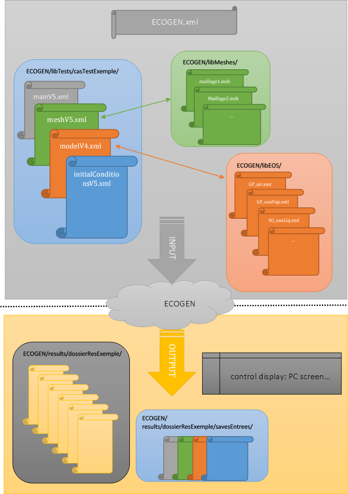

.. _Chap:UserGuide:

I/O descriptions
================
ECOGEN settings are managed via INPUT FILES only. The global INPUT FILES and OUTPUT FILES structure is depicted in :numref:`Fig:userGuide:overview`.

.. _Fig:userGuide:overview:

  Structure of input and output files in ECOGEN

.. toctree::
   :maxdepth: 2
   :caption: Contents:

   Chap3_1inputFiles
   Chap3_2materials
   Chap3_3outputFiles