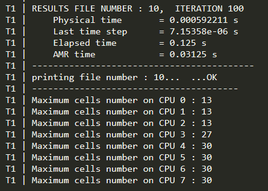

.. _Sec:tuto:begin:

.. role:: xml(code)
  :language: xml

*****************
Start with ECOGEN
*****************

Here is described your first use of ECOGEN: running the *default test case*. This is what user should observe without any change in the downloaded ECOGEN package. 

.. important::

  Before beginning with ECOGEN, you should have succeed all steps of installation instructions of section :ref:`Chap:Start`.

The conductor input file
========================
ECOGEN is mainly controled thanks to the input file named *ECOGEN.xml*. This file looks like :

.. code-block:: xml

  <?xml version = "1.0" encoding = "UTF-8" standalone = "yes"?>
  <ecogen>
    <!-- Euler reference test cases -->
    <!-- -------------------------- -->
    <testCase>./libTests/referenceTestCases/euler/1D/transport/positiveVelocity/</testCase>
    <!-- <testCase>./libTests/referenceTestCases/euler/1D/transport/negativeVelocity/</testCase> -->
    <!-- <testCase>./libTests/referenceTestCases/euler/1D/shockTubes/HPLeft/</testCase> -->
  </ecogen>

Each test case corresponds to specific input files organised in different folders and associated to a markup :xml:`<testCase>`.

When executing ECOGEN, it will run each test case corresponding to the uncommented lines present in the markup :xml:`<ecogen>`. 

A unique line is uncommented in the original file and corresponds to the *default test case*. One should modify the *ECOGEN.xml* input file to run other provided test by uncommenting / commenting lines in this file. New lines can also be added when creating new test cases.

.. _Sec:tuto:default:

Running the default test case
=============================
The default test case provided with ECOGEN package is a single flow test which simply advect a density discontinuity with a positive velocity in 1D. Input files for this test case are present in the folder *./libTests/referenceTestCases/euler/1D/transport/positiveVelocity/*

.. _Fig:tutos:default:CI:

.. figure:: ./_static/tutos/default/CI.jpg
  :scale: 70%
  :align: center

  Initial condition for single phase 1D transport test case.

The initial characteristics of the run are:

+-----------------------------+--------------+
| Characteristic              | value        |
+=============================+==============+
| dimension                   | 1 m          |
+-----------------------------+--------------+
| mesh size                   | 100          |
+-----------------------------+--------------+
| AMR max level               | 3            |
+-----------------------------+--------------+
| discontinuity position      | 0,5 m        |
+-----------------------------+--------------+
| boundary conditions         | transmittive |
+-----------------------------+--------------+
| final solution time         | 0.36 ms      |
+-----------------------------+--------------+
| solution printing frequency | 0.036 ms     |
+-----------------------------+--------------+

This test can be executed on single CPU or on XX CPU by one of the commands:

.. code-block:: console

  ./ECOGEN
  mpirun -np XX ECOGEN

.. note:: 

  Informations on available CPU can be obtained under linux system using the command:

  .. code-block:: console

    /usr/bin/nproc

The code is running and at the top of the console output one can read :
 - The console logo of ECOGEN 
 - The name of the test case including the full path of the test case : *./libTests/referenceTestCases/euler/1D/transport/positiveVelocity/*
 - Information concerning the number of iterations, the elapsed time...

*euler1DTransportPositiveVelocity* is the actual name of the default run.

.. figure:: ./_static/tutos/default/RunECOGEN_Logo.png
  :scale: 100%
  :align: center

  : Screenshot of the top of ECOGEN default run console. In this particular run, 8 CPU have been used.

The code ends and the following information comes:

  : Screenshot of the end of the default run console with 8 CPU used.

A new folder *results* is created at the first run, (unusefull to remove it). This folder contains a folder named *euler1DTransportPositiveVelocity* containing output files of our test case. Are included in :

 - *collection.pvd* used in *Paraview* software and the associated *vtu* files
 - *infoCalcul.out*  
 - *infoMesh* folder
 - *probes* folder 
 - *savesInput* folder: a kind of log folder that contains the *xml* files used for this run.

By default, output files are recorder in VTK XML format in separate files for each CPU, AMR level and TIME. A way to post-treat this output files is to open the *collection.pvd* file using Paraview_ software.

.. _Fig:tutos:default:results:

.. figure:: ./_static/tutos/default/transport.*
  :scale: 50%
  :align: center

  Results for the single phase transport test

This basic test shows advection of a contact discontinuity while preserving pressure and velocity uniform conditions.

Editing input files
-------------------
Input files for this test case are located in the following folder: *./libTests/referenceTestCases/euler/1D/transport/positiveVelocity/*.

Computation parameters will easily be modified according to the input file description of section :ref:`Chap:input`

For example, one can prefer to visualise results under *gnu* file format. For that simply turn the *xml* option in the xml file *\libTests\referenceTestCases\euler\1D\transport\positiveVelocity\mainV5.xml*  into *gnu* and re-run the test case:

.. code-block:: xml

  <outputMode format="GNU" binary="false" precision="10"/>

The results can be drawn by loading in the Gnuplot software the file *visualisation.gnu*.

.. figure:: ./_static/tutos/default/GnuplotScreenshotDefaultUse.png
  :scale: 75%
  :align: center

  : Screenshot of results in *Gnuplot*

.. _Paraview: https://www.paraview.org/