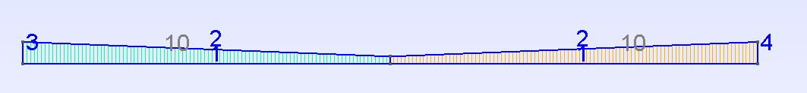

.. _Sec:tuto:generatingMeshes:

Generating Meshes
=================

ECOGEN is able to generate its own Cartesian meshes (see section :ref:`Sec:input:cartesian`), but for structured non Cartesian or unstructured meshes, as seen in section :ref:`Sec:input:unstructured`, an external mesh software is required to generate mesh files.

Mesh files with Gmsh
--------------------

ECOGEN can use mesh files for single- or multi-core computations generated with the open-source Gmsh_ software :cite:`geuzaine2009gmsh` with some specific precautions when editing the geometry file (*.geo*). Only the `MSH file format version 2`_ can be used in the current released version |version| of ECOGEN.

To export your mesh to the version 2, either:

- Download older Gmsh_ binaries before the new mesh file format was introduced, such as version 3.0.6 or lower: http://gmsh.info/bin/.
- Use latest version of Gmsh but export your mesh file to the version 2, for more information see the tutorial :ref:`Sec:tuto:exportGmshFile`.

Here are the restrictions that should be used when generating a geometry with Gmsh_:

- Each part of the domain occupied by the fluid should correspond to a physical surface or a physical volume which is attributed to the value *10*.
- Each boundary condition must correspond to a physical line or a physical surface. The values are successively taken from *1* to maximum *9*. This is an important point that will be used to define boundary conditions with physical treatment in the *initialConditions.xml* input file described in section :ref:`Sec:input:InitialConditions`.

Below is presented an example.

Generating a nozzle unstructured mesh
~~~~~~~~~~~~~~~~~~~~~~~~~~~~~~~~~~~~~

Consider the geometry file of a simple nozzle depicted below:

.. _Fig:tutorials:nozzle_simple:

	Example of geometrical data file -- nozzle2D_example.geo –- for generating a mesh file with *.msh* format using Gmsh software and usable with ECOGEN.

This correponds to the geometry file available in `ECOGEN/libMeshes/nozzles/nozzle2D_example.geo`_.

The computational domain is a nozzle, the mesh is unstructured with quadrangles. In that case, one should take care that the fluid surface is defined by the value *10* and that 4 boundary conditions are set with the following numbering:

- Symmetrical axis:  1 (*boundAxis = 1*)
- Wall: 2 (*boundWall = 2*)
- Injection using stagnation state: 3 (*boundInlet = 3*)
- Imposed pressure: 4 (*boundOutlet = 4*)

The corresponding *initialCondition.xml* file should then contains for example the following markups:

.. code-block:: xml

	<!-- LIST OF BOUNDARY CONDITIONS -->
	<boundaryConditions>
		<boundCond name="axis" type="symmetry" number="1" />
		<boundCond name="wall" type="wall" number="2" />
		<boundCond name="inlet" type="inletTank" number="3">
			<dataInletTank p0="2.e5" T0="187.5"/>
		</boundCond>
		<boundCond name="outlet" type="outletPressure" number="4">
			<dataOutletPressure p0="1.e5"/>
		</boundCond>	
	</boundaryConditions>

This correponds to initialization of a nozzle connected to a tank on the left and to an outflow at imposed pressure to the right.

.. _Gmsh: http://gmsh.info/
.. _`MSH file format version 2`: http://gmsh.info/doc/texinfo/gmsh.html#MSH-file-format-version-2-_0028Legacy_0029
.. _`ECOGEN/libMeshes/nozzles/nozzle2D_example.geo`: https://github.com/code-mphi/ECOGEN/blob/master/libMeshes/nozzles/nozzle2D_example.geo