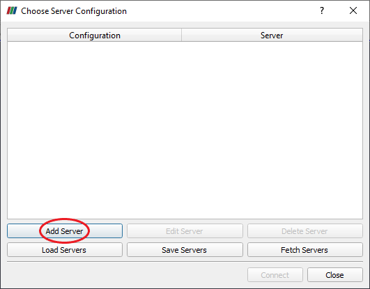
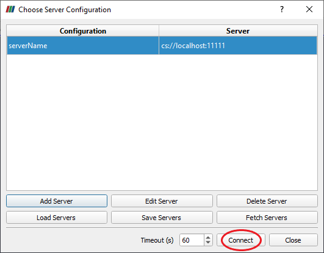

.. role:: xml(code)
  :language: xml

.. _Sec:tuto:paraviewServer:

***************
ParaView server
***************

When computations have been performed on a cluster or require significant graphic resources, it may be interesting to post-process the results on a visualization server. In this tutorial the configuration of a ParaView visualization server and the procedure to connect to it is presented.

Install ParaView
================

To install Paraview on your server directly go to the official `ParaView website`_. 
Under Linux section you can find either full suite of ParaView tools including ParaView GUI client or the headless version if don't plan to render with an X server. 
For the example we will download the complete version and unzip it:

.. highlight:: console

::

  $ wget -O ParaView-5.8.1-MPI-Linux-Python3.7-64bit.tar.gz "https://www.paraview.org/paraview-downloads/download.php?submit=Download&version=v5.8&type=binary&os=Linux&downloadFile=ParaView-5.8.1-MPI-Linux-Python3.7-64bit.tar.gz"
  $ tar -xvf ParaView-5.8.1-MPI-Linux-Python3.7-64bit.tar.gz
  $ rm ParaView-5.8.1-MPI-Linux-Python3.7-64bit.tar.gz

.. important::

  Note that it is strongly recommended to use the same ParaView version on the client side to avoid incompatibility problems.

Setup ParaView server
=====================

In order to easily run ParaView executables we will add its bin folder to the :code:`PATH` environment variable.
Assuming ParaView has been installed into the folder */home/userName/Softwares/* we can edit the path as:

.. highlight:: console

::

  $ sudo echo 'export PATH=/home/userName/Softwares/ParaView-5.8.1-MPI-Linux-Python3.7-64bit/bin:$PATH' >> /home/userName/.bashrc
  $ source /home/userName/.bashrc

To start ParaView server run the :code:`pvserver` executable with the MPI executable provided by ParaView (:code:`-np 1` for sequential use):

.. highlight:: console

::

  $ mpiexec -np 1 pvserver --force-offscreen-rendering
  Waiting for client...
  Connection URL: cs://serverName:11111
  Accepting connection(s): serverName:11111

By default we can see that a ParaView server has been started on the server :code:`serverName` (will be replaced by the actual name of your server) and is waiting for connection on the port :code:`11111`. 
If one would like to change the default port, one can add the option :code:`--server-port=XXXXX`.

.. note::

  The script :code:`run-pvserver.sh` available in the script folder of ECOGEN allows to easily set the path to ParaView (and avoid setting manually the :code:`PATH` variable) and start a server as described above.
  Here is an example to set the path and start the server for the 1st time:

  .. highlight:: console

  ::

    $ ./run-pvserver.sh --path /opt/ParaView-5.8.0-MPI-Linux-Python3.7-64bit/bin/
    Path has been set to /opt/ParaView-5.8.0-MPI-Linux-Python3.7-64bit/bin/.
    $ ./run-pvserver # Using default number of core, i.e. single core
    Waiting for client...
    Connection URL: cs://cid:11111
    Accepting connection(s): cid:11111

  More information is given in the help menu of the script: :code:`./run-pvserver.sh --help`

Connect to ParaView server with client
======================================

Prerequisites
-------------

To access to the ParaView server we need to forward a port from the client machine (:code:`localhost` here) to the server machine (:code:`serverName`). 
As stated in the reference below it will allow the ssh client to listen for connections on a given port, once a connection is received the ssh client will tunnel to the ssh server. 
Lastly, the ssh server connects to an another destination given port, i.e. the one used by the ParaView server.
This procedure is called local forwading and is configured with the :code:`-L` option. On the client machine one can use:

.. highlight:: console

::

  $ ssh -X -N -L localhost:11111:serverName:11111 user@serverName

Here it has been added options :code:`-X` to enable X11 forwading (to export application display) and :code:`-N` to specify that it is not necessary to execute a remote command (stick only to port forwarding).

Be aware that the previous command will not give any output and will stay up until you would like to end-up the connection. If you would like to set this command to background add the :code:`-f` flag.

To avoid to remember the previous ssh command an alias can be added:

.. highlight:: console

::

  $ vim ~/.bash_aliases
  alias ssh-port='ssh -X -f -N -L localhost:11111:serverName:11111 user@serverName'

Now to do to port forwarding run:

.. highlight:: console

::

  $ ssh-port

Reference: `ssh tunneling`_

ParaView client usage
---------------------

The final step is to connect to the ParaView server directly from your ParaView client. 
To proceed, open the ParaView client GUI and click on the *Connect* button:

.. figure:: ./_static/tutos/paraviewServer/gui.png
  :scale: 50%
  :align: center

  Connect button on ParaView GUI.

Add your server as described below (keep manual configuration and save):

  Initial server list.

.. figure:: ./_static/tutos/paraviewServer/serverConfig.png
  :scale: 75%
  :align: center

  Server configuration.

Connect to your server:

  Final server list.

.. _Paraview website: https://www.paraview.org/
.. _ssh tunneling: https://www.ssh.com/ssh/tunneling/example