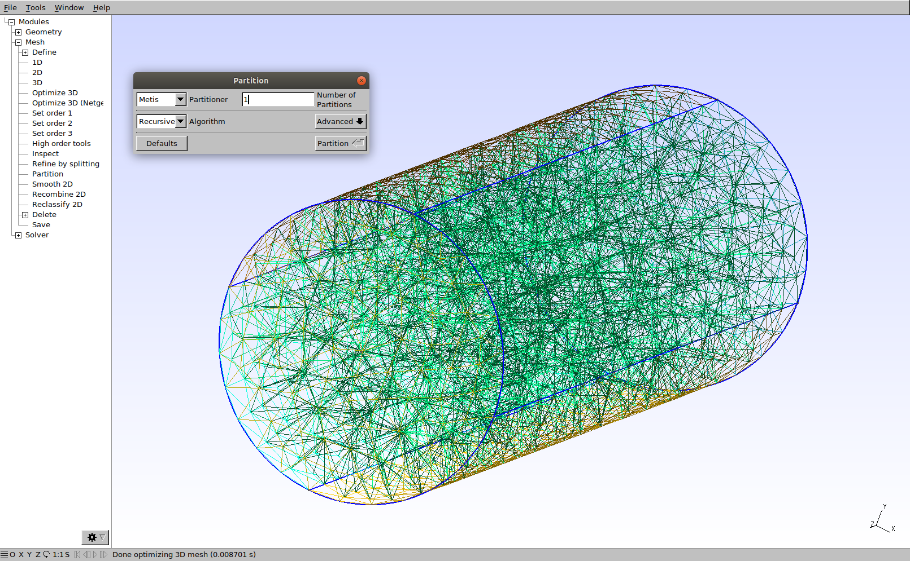
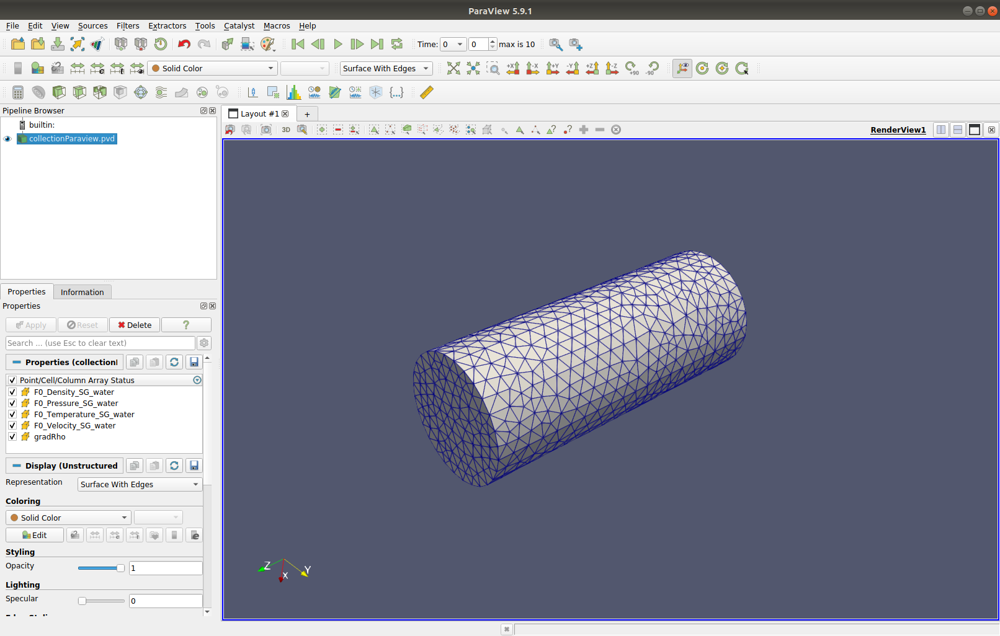
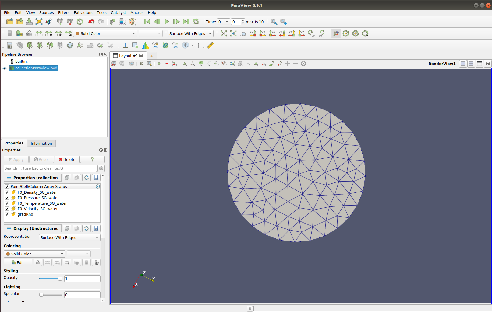
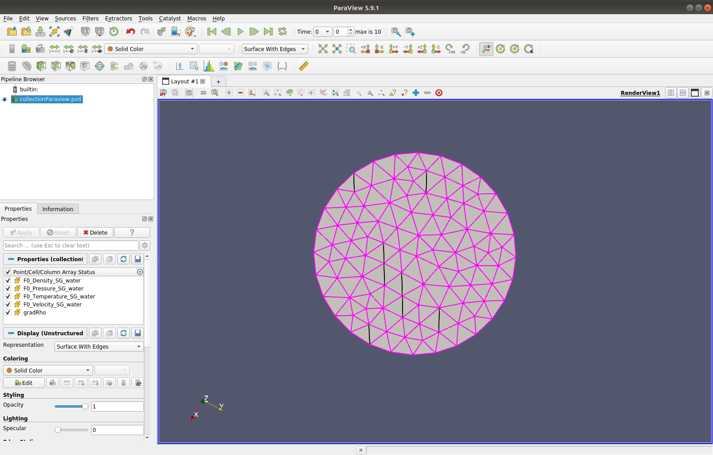
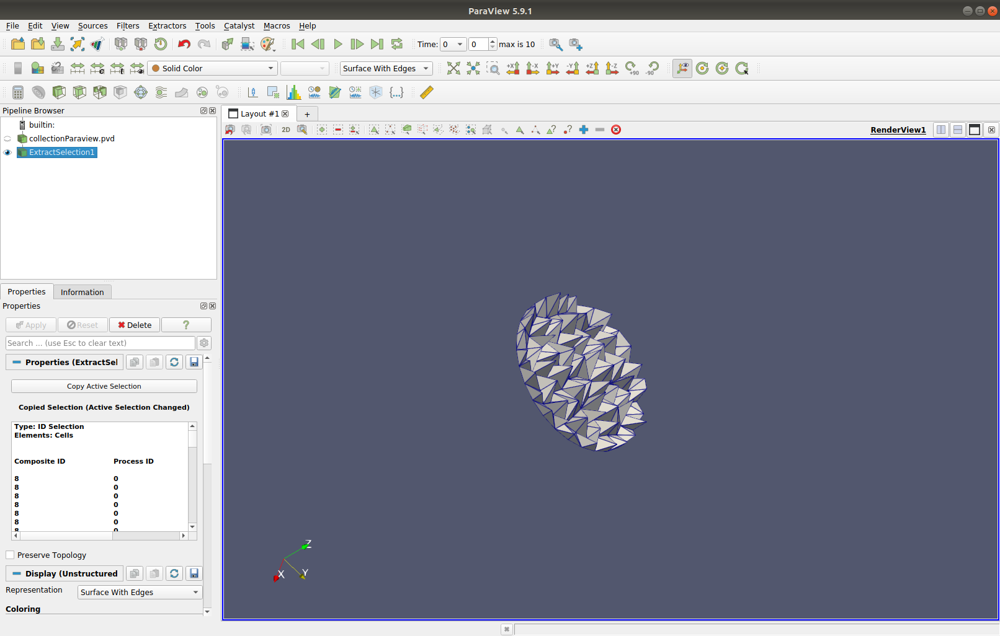
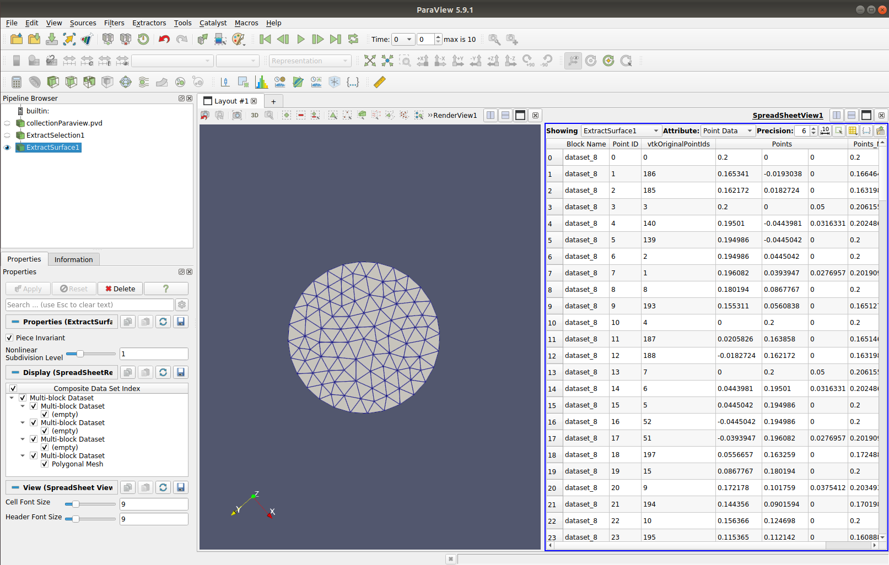

.. role:: xml(code)
  :language: xml

.. _Sec:tuto:extractMassflow:

*********************************************
Gmsh example and extraction of mass-flow rate
*********************************************

One might needs to extract the mass-flow rate throught a specific surface/boundary. Some CFD tools such as OpenFOAM or SimFlow allows to select a specific boundary in the properties field of your dataset and work directly from there. 
However, in ECOGEN the output data is generated as a multi-block dataset: a block for each core. Thus, it is required to extract the boundary in `ParaView`_ as described below. By this example we will also show how to use `Gmsh`_.

Generate .msh file
==================

* To generate msh files, one needs to use **Gmsh** with the *.geo* file that can be found on *./libMeshes*. Here, we will use *cylinderUnstructured.geo*.

.. figure:: ./_static/tutos/extractMassflowWithParaview1/gmsh1.png
    :scale: 30%
    :align: center
	
    Screenshot of the geometry.

* Now, as it is a 3D geometry, one has to click on 3D in the :xml:`Mesh` tab, and partition to select how many cores will be used, and then click on partition before closing this window. 

    Partition menu.

* Finally, still on the :xml:`Mesh` tab, click on :xml:`Save`. The .msh files will be in the *./libMeshes* folder.

In case you are using latest version of **Gmsh**, you might need to export your mesh file to the previous mesh file format, for more information see the tutorial :ref:`Sec:tuto:exportGmshFile`.

Cylinder Test case
==================

* The test used here will be a water flow through a cylinder in 3D. One side has an injection condition with a surface mass flow of 3000 kg/m/s² and a temperature of 300K. The other side has an outflow condition with a pressure of 1 bar. The fluid used here is water.

The initial characteristics of the run are:

+-----------------------------+----------------------+
| Characteristic              | Value                |
+=============================+======================+
| Length                      | 1 m                  |
+-----------------------------+----------------------+
| Radius                      | 0.2 m                |
+-----------------------------+----------------------+
| Characteristic mesh length  | 0.05                 |
+-----------------------------+----------------------+
| final solution time         | 5 s                  |
+-----------------------------+----------------------+
| solution printing frequency | 0.5 s                |
+-----------------------------+----------------------+
| precision                   | 1st order            |
+-----------------------------+----------------------+

ParaView
========

* Once your data is loaded in **ParaView**, display your geometry with :xml:`Solid Color` and :xml:`Surface With Edges` to see the cells. 

    Loading data.

* Change the view to see the boundary of interest.

    Set the view focused on the boundary of interest.

* On the layout window click on :xml:`Select Cells On` and select the cells located on the boundary.

    Selection of the cells on the boundary.

* Apply the Filter :xml:`Extract Selection` to keep only these cells.

* Again, it is recommended to use :xml:`Solid Color` view with :xml:`Surface With Edges` to correctly see the cells that we are working on. It is possible to rotate the view to observe the shape of the cells.

    View of the cells extracted.

* Extract all the surfaces of the cells using filter :xml:`Extract Surface`.

    Extraction of surfaces of the cells.

*  Apply the filter :xml:`Cell Size` to obtain the area of each surface. Area of surface can be seen in spreadsheet view as below.

.. important:: 
    There is a known bug of **ParaView** version 5.7 for the filter :xml:`Cell Size` which leads to a crash. To prevent this, use 5.8 or higher version.

* Select surfaces of cells on the boundary and apply the :xml:`Extract Selection` filter to keep only those surfaces.

.. figure:: ./_static/tutos/extractMassflowWithParaview1/6.png
    :scale: 30%
    :align: center

    Extraction of boundary surfaces.

* Use the :xml:`Calculator` filter to compute the specific mass flow (kg/m/s²) given by the product of density and the normal velocity component (here z) of the boundary. The output result is named :xml:`massflow` and can be seen in the spreadsheet. Thus we have the specific mass flow of each surface of the boundary and now we need to take into account the surface area.

.. important::
    Obviously if the boundary normal and one of the velocity component are not colinear you can't reproduce directly the dot product and you will need to perform some additionnal steps not described here.

.. figure:: ./_static/tutos/extractMassflowWithParaview1/7.png
    :scale: 30%
    :align: center

    Calculator filter used to compute specific mass-flow rate through each surface of boundary.

* The :xml:`Integrate Variables` filter allows to compute the sum of each specific mass flow times the corresponding surface as following:

.. math::

    \dot{m} = \sum_{i} \rho_i u_i S_i

.. figure:: ./_static/tutos/extractMassFlowWithParaview1/8.png
    :scale: 30%
    :align: center

    Integrate filter.

* The filter :xml:`Plot Data Over Time` will give the mass flow over time.

.. figure:: ./_static/tutos/extractMassFlowWithParaview1/9.png
    :scale: 30%
    :align: center

    Resulting plot of mass-flow rate through the outflow boundary over time.

Comparison with gnuplot
=======================

* To make sure these values are correct, we can compare them with other ones. In *main.xml*, one can record the mass flow at both boundaries with the lines:

.. code-block:: console

	<recordBoundaryFlux name="outflow">
      <boundary number="3" flux="massflow"/>
      <timeControl acqFreq="0.5"/>
	</recordBoundaryFlux>

	<recordBoundaryFlux name="inflow">
      <boundary number="2" flux="massflow"/>
      <timeControl acqFreq="0.5"/>
	</recordBoundaryFlux>

* Results will be in the folder *./boundariesFlux*.

.. note::
    As the normal vector of the inflow boundary is not oriented to the flow direction, values will be negatives. One has to put 1:(abs($2)) instead of 1:2 in the *visualisation_inflow.gnu*

On **ParaView**, one can extract mass flow values with :xml:`Save Data`.

The results can be drawn by loading in the `gnuplot`_ software the 3 files: *visualization_inflow.gnu*, *visualization_outflow.gnu* and the one from **ParaView** to see if they overlay.

.. figure:: ./_static/tutos/extractMassFlowWithParaview1/10.png
    :align: center

    Resulting plot of mass flow with **gnuplot**.

    .. _Gmsh: http://gmsh.info/
    .. _gnuplot: http://www.gnuplot.info/
    .. _ParaView: https://www.paraview.org/