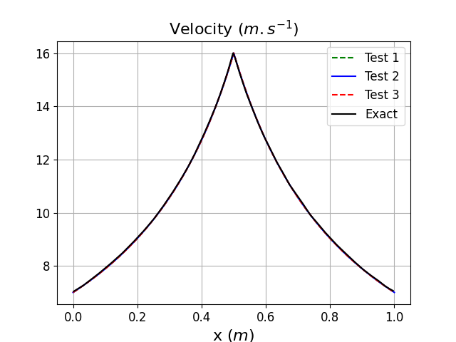

.. role:: xml(code)
  :language: xml

.. _Sec:tuto:restartMeshMapping:

**************************************
Restart a simulation with mesh mapping
**************************************

In ECOGEN it is possible to initialize a simulation with the result of a previous simulation performed on a different mesh and/or a different number of cores.
The main use case is to accelerate the convergence to the steady state by using a previous simulation performed on a coarse mesh, but it can also be used to restart a simulation on a different number of cores. 

Overview
========

In this tutorial, this mesh mapping method is used to fasten convergence towards steady state of a subsonic flow in a convergent-divergent nozzle. 
To build our test case, we consider the following reference test case in the *ECOGEN.xml* file:

.. code-block:: xml

  <testCase>libTests/referenceTestCases/euler/2D/nozzles/lowMachSmoothCrossSection/</testCase>

In this test case, originally from :cite:`lemartelot2013lowmach`, a subsonic flow of liquid water is injected into the nozzle as shown in :numref:`Fig:tutos:restartMeshMapping:nozzle`. 
At the inlet, the mass flow rate is imposed as well as the total stagnation enthalpy using the pressure and density. 
At the outlet, the pressure is fixed. These boundary conditions lead to a subsonic flow in the whole nozzle.

.. _Fig:tutos:restartMeshMapping:nozzle:

.. figure:: ./_static/tutos/restartMeshMapping/nozzle.png
  :scale: 70%
  :align: center

  Setup for the subsonic flow within the convergent-divergent nozzle.

Since the cross-section variation along the nozzle is smooth, a 1D mesh is considered and the numerical scheme is adapted to include the impact on the flow of the upper and lower walls of the nozzle using the method described in :cite:`lemartelot2013lowmach`.

This can be done by adding the following node to the *model.xml* file:

.. code-block:: xml

  <geometry smoothCrossSection1d="true"/>

Note that by default a low-Mach preconditioning technique (see :cite:`lemartelot2013lowmach`) is defined in this test case to properly capture the flow at the throat.
Since the same effect can be obtained with a very fine mesh and our goal is to provide a configuration demonstrating the interest of the mesh mapping, this option is disabled:

.. code-block:: xml

  <lowMach state="false"/>

In this tutorial, we will first run a simulation on a coarse mesh until the steady state is reached. 
Then, this simulation will be used to initialize another simulation on a finer mesh. 
The proper behavior of the mesh mapping will be checked and a discussion of the time saved with the mapping is provided.

Run a simulation on a coarse mesh
=================================

.. note:: 

  In the following, in order to demonstrate that steady state solution obtained with the mesh mapping method corresponds to the exact solution, a coarse mesh of *Nx = 1 000* and a fine one of *Nx = 10 000* cells are used. 
  Simulations with these meshes can be quite long, therefore for testing purpose the reader is advised to test with *Nx = 100* and *Nx = 1 000* cells. 

To run the simulation on two cores, use:

.. code-block:: console

  mpirun -np 2 ECOGEN

To check that steady state is reached, flow quantities can be checked using a visualization software such as Paraview.
Note that it might be useful to compare the massflow between the inlet and outlet of the nozzle to make sure steady state is reached. 
Massflow rate can be recorded with the :xml:`<recordBoundaryFlux>` node in the *main.xml* file, for more information about this, see the tutorial :ref:`Sec:tuto:extractMassflow`.

Setup the restart with mesh mapping
===================================

Now that we have a steady state result obtained on a coarse mesh, we will use it to initialize our simulation on a fine mesh of about *Nx = 10 000* cells.
First, make sure to change the name of the result folder to avoid erasing the simulation on the coarse mesh. 
This can be done by changing the following line in *main.xml*:

.. code-block:: xml

  <run>euler2DnozzleLowMachSmoothCrossSection_fine</run>

Now we need to change the mesh to the fine one and add the mesh mapping option with the adequate parameters.
It needs to be provided with the results folder of the previous coarse mesh simulation, the file to restart to and the mesh file used before.
Taking into consideration these remarks, the *mesh.xml* file is modified as follow:

.. code-block:: xml

  <?xml version="1.0" encoding="UTF-8"?>
  <mesh>
  <type structure="unStructured"/>
    
    <unstructuredMesh>
      <file name="libMeshes/nozzles/smoothNozzle2DforLowMach_Nx10000_10cpu.msh"/>
      <parallel GMSHPretraitement="true"/>

      <meshMappingRestart 
        resultFolder="euler2DnozzleLowMachSmoothCrossSection_coarse" 
        restartFileNumber="1000" 
        meshFile="libMeshes/nozzles/smoothNozzle2DforLowMach_Nx1000_2cpu.msh"
      /> 

    </unstructuredMesh>
  </mesh>

The simulation is ready to be run, in this case the mesh is partitionned on 10 cores.
Therefore ECOGEN must be executed using:

.. code-block:: console

  mpirun -np 10 ECOGEN

Results
=======

To determine how much time is saved thanks to the mesh mapping, one can also run the simulation on the fine mesh *Nx = 10 000* using basic initial conditions, this run corresponds to test number 3 in the table below.
The initial run on the coarse mesh corresponds to test number 1 and the run with the mesh mapping is the run number 2.

+------+-------------------+--------------+------------+----------------------------+----------------------------+
| Test | Description       | Mesh (Nx)    | Nb of CPUs | Simulation time (h:m:s)    | Cumulative time (h:m:s)    |
+======+===================+==============+============+============================+============================+
| 1    | Direct run        | 1000         | 1          | 0:36:29                    | 0:36:29                    |
+------+-------------------+--------------+------------+----------------------------+----------------------------+
| 2    | Mapping on test 1 | 10000        | 10         | 4:54:15                    | 5:30:44                    |
+------+-------------------+--------------+------------+----------------------------+----------------------------+
| 3    | Direct run        | 10000        | 10         | 9:23:36                    | 9:23:36                    |
+------+-------------------+--------------+------------+----------------------------+----------------------------+

In :numref:`Fig:tutos:restartMeshMapping:p` and :numref:`Fig:tutos:restartMeshMapping:ux`, we can clearly see that that the same steady state is reached whether the mesh mapping is used or not (see Test 2 and 3) and that an excellent agreement with the exact solution is observed.
From the cumulative simulation time reported in table above, it can be noticed that the mesh mapping method reduces the simulation time to steady state by more than 50% compared to the direct run when no mesh mapping is used (Test 3) and this even if the initial solution obtained on the coarse mesh is still far from the exact solution.

.. _Fig:tutos:restartMeshMapping:p:

.. figure:: ./_static/tutos/restartMeshMapping/p.png
  :scale: 50%
  :align: center

  Pressure distribution along the nozzle length

.. _Fig:tutos:restartMeshMapping:ux:

  Velocity distribution along the nozzle length