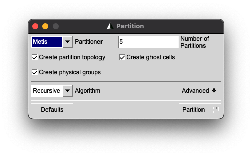

.. role:: xml(code)
  :language: xml

.. _Sec:tuto:exportGmshFile:

*****************************************
Export Gmsh mesh to version 2 file format
*****************************************

Since ECOGEN mainly supports Gmsh_ [GR09] :cite:`geuzaine2009gmsh` **version 2** mesh files, and the latest Gmsh software currently uses **version 4** by default, we recommend exporting the mesh file to **version 2**.

To do so, use `File -> Export`, choose `Gmsh version 2 ASCII` format and make sure additionnal options **are not** checked.

.. _Fig:tutos:exportGmshFile:export:

.. figure:: ./_static/tutos/exportGmshFile/export.png
  :scale: 80%
  :align: center

  Gmsh export window.

If the mesh has to be partitionned, check also the option `Create ghost` cells to have a mesh file fully compatible with ECOGEN.

.. _Fig:tutos:exportGmshFile:partition:

  Gmsh partition window.

.. _Gmsh: http://gmsh.info/